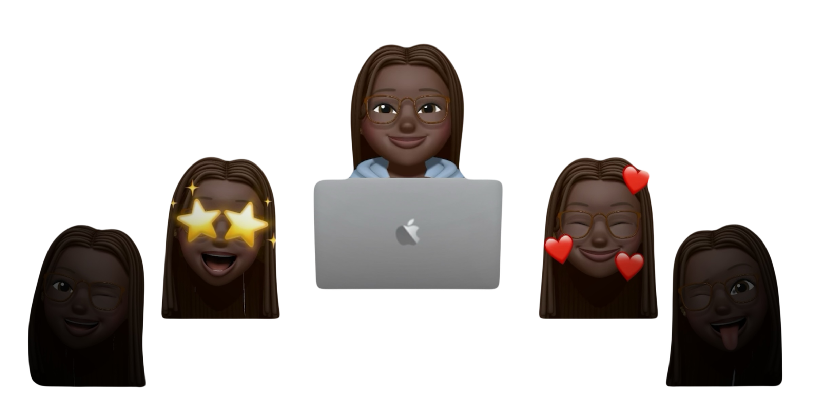

# welcome ¡!

<figure><figcaption></figcaption></figure>

<h2 align="center">Welcome to yolandamazi's blog!</h2>

***

### — who am i?

* I'm a student pursuing a Bachelor's degree in <mark style="color:$primary;">Computer Engineering</mark> at the Escuela Politécnica Superior @ UAH.
* My main interest lie in <mark style="color:$primary;">cybersecurity</mark>, focusing on deepening my knowledge and practical skills.
* Currently working as a <mark style="color:$primary;">Junior Analyst</mark> in Crisis & Incident Response @ Deloitte T\&T Cyber.
* Check out my [resume](https://drive.google.com/file/d/1LX3JLYcRwBXYVGnbMFfzHElTafTa703i/view?usp=sharing) for more details about <mark style="color:$primary;">my background</mark> — I’m always open to feedback and suggestions!

### — what's my purpose?

Documenting what I’m actively learning and building as I grow through my journey in cybersecurity and engineering. Right now, I’m focused on studying for cybersecurity certifications, strengthening my technical foundations, and developing the hands-on skills needed in the security field. I will write about the certificates I’m pursuing, the concepts I’m studying, the tools I’m practicing, and my progress as I train to become better at solving machines and understanding systems more deeply. This helps me stay consistent, reflect on my growth, and keep a clear record of everything I learn as I continue developing in the cybersecurity world.

### — contact

[Linkedin](https://www.linkedin.com/in/yolanda-omoregbee-amazi/) | [GitHub](https://github.com/yolandamazi) | [Email](mailto:yolanda.omoregbee@edu.uah.es)&#x20;

***

> _**"you must be the change you wanna see in the world"**_  ✧&#x20;
