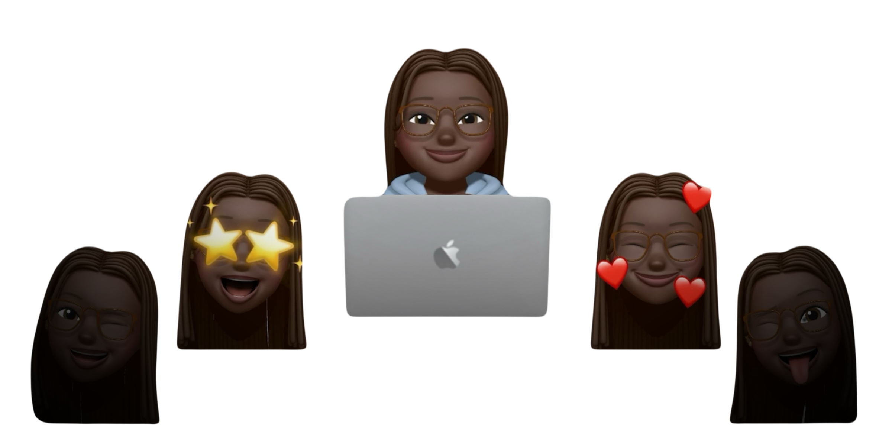

# welcome ¡!

<figure><figcaption></figcaption></figure>

<h2 align="center">Welcome to yolandamazi's blog!</h2>

***

### — who am i?

* <mark style="color:$primary;">Computer Engineering</mark> Graduate @ Universidad de Alcalá.
* My main interest lie in <mark style="color:$primary;">data science, AI & ML</mark>, focusing on deepening my knowledge and practical skills.

  &#x20;Check out my [resume](https://drive.google.com/file/d/1HzELR5w2EfgwZzcS-MZo0roDEhNj0zI5/view?usp=sharing) for more details about <mark style="color:$primary;">my background</mark> — I’m always open to feedback and suggestions!

### — what's my purpose?

Documenting what I’m actively learning and building as I grow through my journey in data science & machine learning. Right now, I’m focused on studying for certifications, strengthening my technical foundations, and developing the hands-on skills needed in the field. I will write about the certificates I’m pursuing, the concepts I’m studying, the tools I’m practicing, and my progress as I train to become better. Additionally, I’ll track my language studies, including reinforcing my English skills and learning French as a new language. This helps me stay consistent, reflect on my growth, improve my language skills, and keep a clear record of everything I learn as I continue developing in the AI world.

### — behind the writing

You might notice I switch between Spanish and English across the blog. There’s no specific reason for this. There are some topics I simply feel more natural to write in one language or the other. I hope this won’t get in the way of understanding the information I’m sharing!

### — contact

[Linkedin](https://www.linkedin.com/in/yolanda-omoregbee-amazi/) | [GitHub](https://github.com/yolandamazi) | [Email](mailto:yolanda.omoregbee@gmail.com)&#x20;

***

> _**"you must be the change you wanna see in the world"**_  ✧&#x20;
