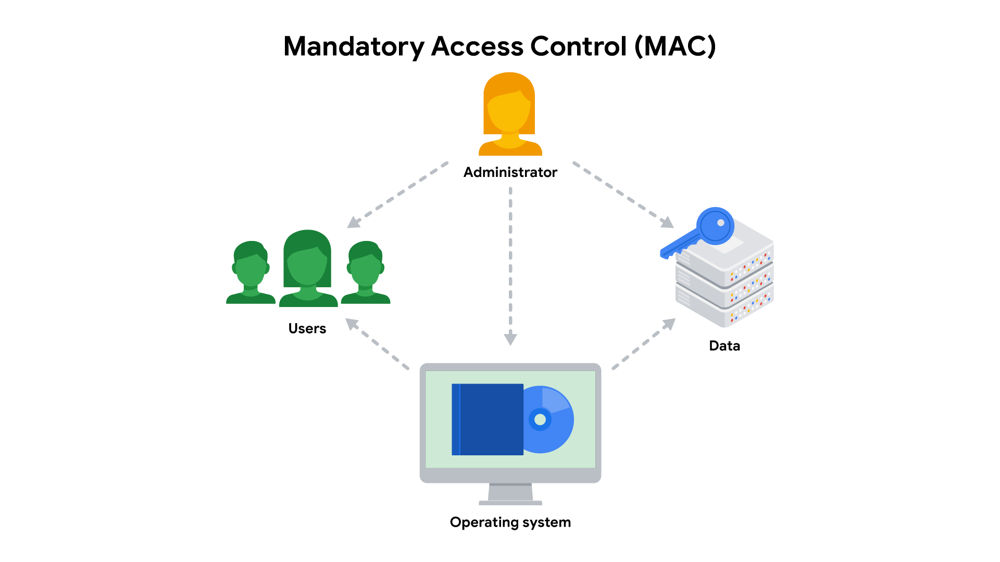

---
layout:
  width: default
  title:
    visible: true
  description:
    visible: false
  tableOfContents:
    visible: true
  outline:
    visible: true
  pagination:
    visible: true
  metadata:
    visible: true
  tags:
    visible: true
---

# Google Cybersecurity Profesional Certificate

## 0. Introduction

To get hands-on experience in cybersecurity, I’ve enrolled in the Google Cybersecurity Professional Certificate. My goal is to learn the basics through this course before deepening my skills.&#x20;

<figure><figcaption></figcaption></figure>

I’ve already completed the first three courses, which are:

* Foundations of Cybersecurity
* Play It Safe: Manage Security Risks
* Connect and Protect: Networks and Network Security

For the remaining courses, I’ll keep track of my learning through the blog, documenting the notes I consider important or relevant.

## 1. Course 4: Tools of the Trade: Linux and SQL

### 1.1 Introduction to OS

* **OS (Operating System)**: the interface between the computer hardware and the user
* **Legacy Operating System**: an OS that is not up to date while is still in use from a user. Might be vulnerable to new threats
* **Basic Input/Output System (BIOS):** a microchip that contains loading instructions for the computer and is prevalent in older systems. It's activated when you boot your computer. Standard chip since 2007.
* **Unified Extensible Firmware Interface (UEFI):** a microchip that is activated when you boot your computer and contains loading instructions for the computer and replaces BIOS on more modern systems. Mostly used on new computers.
* **Bootloader**: a software program activated by the last instruction of the microchip during the computer’s boot process. It is responsible for starting the operating system.
* **Virtual Machine (VM)**: is a virtual version of a physical computer. There are machines that don’t exist physically, but operate like they do because their software simulates physical hardware.
  * Some benefits include improved _security_ due to its isolated environment, as well as increased _efficiency_, since you can streamline multiple tasks across different machines.
* **Virtualization:** process of using software to create virtual representations of various physical machines.
* **Command Line Interface (CLI)**: a user interface that uses commands to interact with the computer
* **Graphical User Interface (GUI)**: a user interface that uses icons on the screen to manage different tasks on the computer

### 1.2 The Linux OS

* **Kernel**: a component of the Linux OS that manages processes and memory. The shell processes commands and outputs the results.
* **Filesystem Hierarchy Standard (FHS):** component of the Linux OS that organizes data. It specifies the location where data is stored in the operating system.
* **Central Processing Unit (CPU):** a computer’s main processor, which is used to perform general computing tasks on a computer. It executes the instructions provided by programs, which enables these programs to run.
* **Random Access Memory (RAM):** a hardware component used for short-term memory. It’s where data is stored temporarily as you perform tasks on your computer.
* **Hard drive**: a hardware component used for long-term memory.
* **Package**: a piece of software that can be combined with other packages to form an application. It contains the files necessary for an application to be installed including dependencies, which are supplemental files used to run an application.
* **Package managers:** is a tool that helps resolve any issues with dependencies and perform other management tasks such as install, manage, and remove packages or applications.&#x20;
  * Different package managers typically use different file extensions. For example:
    * _Red Hat Package Manager (RPM)_ has files which use the .rpm file extension, such as Package-Version-Release\_Architecture.rpm.
    * _Debian-derived_ Linux distributions, such as dpkg, have files which use the .deb file extension, such as Package\_Version-Release\_Architecture.deb.
* **Advanced Package Tool (APT)
  :** a tool used with Debian-derived distributions. It is run from the command line interface to manage, search, and install packages.
* **Yellowdog Updater Modified (YUM)**
  : a tool used with Red Hat derived distributions. It is run from the command line interface to manage, search, and install packages and it works with .rpm files.
* **Shell:** is the command-line interpreter that processes commands and outputs the results. It´s able to return an output or an error message
  * Different types:
    * _Bourne-Again Shell (bash)_: is the default shell in most Linux distributions since it is considered a user-friendly shell.
    * _C Shell (csh)_
    * _Korn Shell (ksh)_
    * _Enhanced C shell (tcsh)_
    * _Z Shell (zsh)_
* **Standard error:** error messages returned by the OS through the shell. Information returned by the OS through the shell is standard output.
* **Standard input:** sent to the operating system.
* **Standard output:** sent from the operating system.

**Commands learned:**

```bash
# ensure APT is installed
apt
# install/remove an app, sudo is required for elevated privileges 
sudo apt install [app_name]
sudo apt remove [app_name]
# verify [app_name] has been installed/uninstalled
[app_name]
# list all installed applications
apt list --installed
# generate output command
echo
# generate output command
expr
# clear the Bash shell command
clear
```

### 1.3 Linux commands in the bash shell

* **Root directory:** the highest-level directory in Linux, and it’s always represented with a forward slash (/).
* **Standard FHS directories:**
  &#x20;directories directly below the root directory
  * /home
  * /bin: stands for “binary” and contains binary files and other executables.&#x20;
  * /etc: stores the system’s configuration files.
  * /tmp: stores many temporary files.&#x20;
  * /mnt: stands for “mount” and stores media.
* **Executables**: files that contain a series of commands a computer needs to follow to run programs and perform other functions.
* **Root user:** user with elevated privileges to modify files.
* **sudo**: super-user-do
* **authentication**: The process of verifying who someone is
* **authorization**: The concept of granting access to specific resources in a system

```bash
# display names of files and directories in the current working directory
ls
# returns the directory that you’re currently in
pwd
# navigates between directories
cd
# displays the content of a file
cat
# displays just the beginning of a file, by default 10 lines
head
# change the number of lines returned, specify the number of lines by including -n
head -n [num_lines] [doc_name]
# display just the end of a file, by default 10 lines
tail
# returns the content of a file one page at a time
less
# searches a file and returns all lines in the file containing a string or text
grep [string]
# sends the standard output of a command as standard input to another command
[ouput] | [input]
# search for files and directories that contain a string in the name, are a file size, or were last modified within a certain time
find
# specify the string you’re searching for
find [directory/file] -name "[string]"
find [directory/file] -iname "[string]"
# search files or directories last modified within a certain time frame based on days
find [directory/file] -mtime [-/+ days] 
# create a new file
touch [file]
# creates a new directory
mkdir [directory]
# removes, or deletes, a directory
rmdir [directory]
# removes, or deletes, a file 
rm [file]
# moves a file or directory to a new location and also to rename files
mv [directory/file] [directory]
mv [file_name] [file_name] 
# copy a file to a directory
cp [file] [directory]
# open an existing file or create a new file (ctrl + o & ctrl + x to save)
nano [file]
# overwrites your file, if does not exist it creates it
echo [string] > [file]
# >> adds your content to the end of a file
echo [string] >> [file]
# displays hidden files which start with a period (.) at the beginning.
ls -a
# displays permissions to files and directories, and also other additional information, including owner name, group, file size, and last modification time.
ls -l
# displays permissions to files and directories, including hidden files. This is a combination of the other two options.
ls -la
# changes permissions on files and directories.
chmod [user_permissions], [group_permissions], [others_permissions], [document/directory]
# adds a user to the system, it can be added to a -g, default group; -G, additional group
sudo useradd [user]
sudo useradd [group] [user]
# modifies existing user accounts, to change the primary group of an existing user -g; to add supplemental group for an existing user -G
sudo usermod [group] [group_name] [user]
# changes the user’s home directory.
sudo usermod -d [directory] [user]
# changes the user’s login name.
sudo usermod -l [name] [user]
# locks the account so the user can’t log in.
sudo usermod -L [user]
# deletes a user from the system.
sudo userdel [user]
# changes ownership of a file or directory
sudo chown [user] [file/directory]
# change group owner, add ":" before group to designate it as a group name.
sudo chown :[group] [file/directory]
# display information on what other commands are and how they work
man [command]
# search for a command even if they do not know the specific command name.
apropos [word]
# search for multiple words.
apropos -a [word_1] [word_2] ... [word_n]
# displays a description of a command on a single line
whatis [command]
```

**Permissions Format**

<table><thead><tr><th width="113.79998779296875">Character</th><th width="124.20001220703125">Example</th><th>Meaning</th></tr></thead><tbody><tr><td>1st</td><td><strong>d</strong>rwxrwxrwx</td><td><p>file type : </p><ul><li>d for directory</li><li>"-" for a regular file</li></ul></td></tr><tr><td>2nd</td><td>d<strong>r</strong>wxrwxrwx</td><td><p>read permissions for user :</p><ul><li>"r" if it has read permissions</li><li>"-" if it lacks read permissions</li></ul></td></tr><tr><td>3rd</td><td>dr<strong>w</strong>xrwxrwx</td><td><p>write permissions for the user : </p><ul><li>"w" if the user has write permissions</li><li>"-" if the user lacks write permissions</li></ul></td></tr><tr><td>4th</td><td>drw<strong>x</strong>rwxrwx</td><td><p>execute permissions for the user : </p><ul><li>"x" if the user has execute permissions</li><li>"-" if the user lacks execute permissions</li></ul></td></tr><tr><td>5th</td><td>drwx<strong>r</strong>wxrwx</td><td><p>read permissions for the group : </p><ul><li>"r" if the group has read permissions</li><li>"-" if the group lacks read permission</li></ul></td></tr><tr><td>6th</td><td>drwxr<strong>w</strong>xrwx</td><td><p>write permissions for the group : </p><ul><li>"w" if the group has write permissions</li><li>"-" if the group lacks write permission</li></ul></td></tr><tr><td>7th</td><td>drwx<strong>r</strong>w<strong>x</strong>rwx</td><td><p>execute permissions for the group : </p><ul><li>"x" if the group has execute permissions</li><li>"-" if the group lacks execute permissions</li></ul></td></tr><tr><td>8th</td><td>drwxrwx<strong>r</strong>wx</td><td><p>read permissions for other : </p><ul><li>"r" if the other owner type has read permissions</li><li>"-" if the other owner type lacks read permissions</li></ul></td></tr><tr><td>9th</td><td>drwxrwxr<strong>w</strong>x</td><td><p>write permissions for other :</p><ul><li>"w" if the other owner type has write permissions</li><li>"-" if the other owner type lacks write permissions</li></ul></td></tr><tr><td>10th</td><td>drwxrwxrw<strong>x</strong></td><td><p>execute permissions for other :</p><ul><li>"x" if the other owner type has execute permissions</li><li>"-" if the other owner type lacks execute permissions</li></ul></td></tr></tbody></table>

**Chmod permissions format: \[u/g/o]\[+/-/=]\[permissions]**

<table><thead><tr><th width="113.99993896484375">Character</th><th>Description</th></tr></thead><tbody><tr><td>u</td><td>indicates changes will be made to user permissions</td></tr><tr><td>g</td><td>indicates changes will be made to group permissions</td></tr><tr><td>o</td><td>indicates changes will be made to other permissions</td></tr><tr><td>+</td><td>adds permissions to the user, group, or other</td></tr><tr><td>-</td><td>removes permissions from the user, group, or other</td></tr><tr><td>=</td><td>assigns permissions for the user, group, or other</td></tr></tbody></table>

### 1.4 Databases and SQL

* **SQL (Structured Query Language):** programming language used to create, interact and request information from a database
* **Wildcard**: is a special character that can be substituted with any other character.
* **Relational database:** A structured database containing tables that are related to each other
* **Foreign key:** column in a table that is a primary key in another table

```sql
--- display the whole table 
SELECT * FROM [table]
--- display the columns
SELECT [column_1], [column_2], ... [column_n] FROM [table]
--- which table to query
FROM [table]
--- sequences the records in a ascending order by a query based on column or columns. 
ORDER BY [column_1], [column_2], ... [column_n] 
--- sequences the records in a descending order by a query based on column or columns. 
ORDER BY [column_1], [column_2], ... [column_n] DESC;
--- create a filter
SELECT [column] FROM [table] WHERE [column] = [filter_value];
---  apply wildcards to the filter
SELECT [column] FROM [table] WHERE [column] LIKE [wildcard];
--- incorporate comparison operators (<, >, <=, >=, =, !=, <>)
SELECT [column] FROM [table] WHERE [column] [operator] [filter_value];
--- filters for numbers or dates within a range
SELECT [column] FROM [table] WHERE [column] BETWEEN ['date_1'] AND ['date_2'];
--- incorporate logical operators (AND, OR, NOT)
SELECT [column] FROM [table] WHERE [column] [operator] [filter_value] [logical_operator] [column] [operator] [filter_value];
--- inner join: rows that match on a specified column
SELECT [column] FROM [table_1] INNER JOIN [table_2] ON [table_1].[column] [operator] [table_2].[column]
--- left join: returns all the records of the first table and the rows of the second table that match on a column
SELECT [column] FROM [table_1] LEFT JOIN [table_2] ON [table_1].[column] [operator] [table_2].[column]
--- right join: returns all of the records of the second table and the rows from the first table that match on a specified column. 
SELECT [column] FROM [table_1] RIGHT JOIN [table_2] ON [table_1].[column] [operator] [table_2].[column]
--- full outer join: returns all records from both tables completely merging them.
SELECT [column] FROM [table_1] FULL OUTER JOIN [table_2] ON [table_1].[column] [operator] [table_2].[column]
--- returns a single number that represents the number of rows returned from your query.
SELECT COUNT(column) FROM [table];
--- returns a single number that represents the average of the numerical data in a column.
SELECT AVG(column) FROM [table];
--- returns a single number that represents the sum of the numerical data in a column.
SELECT SUM(column) FROM [table];
```

**Wildcards applied to the string 'a' and examples:**

<table><thead><tr><th width="95.5999755859375">Pattern</th><th>Results that could be returned</th></tr></thead><tbody><tr><td>'a%'</td><td>apple123, art, a</td></tr><tr><td>'a_'</td><td>as, an, a7</td></tr><tr><td>'a__'</td><td>as, an, a7</td></tr><tr><td>'%a'</td><td>pizza, Z6ra, a</td></tr><tr><td>'_a'</td><td>ma, 1a, Ha</td></tr><tr><td>'%a%'</td><td>Again, back, a</td></tr><tr><td>'_a<em>_</em>'</td><td>Car, ban, ea7</td></tr></tbody></table>

## 2. Course 5: Assets, Threats and Vulnerabilities

### 2.1 Introduction to asset security

* **Compliance:** process of adhering to internal standards and external regulations, a way of measuring how well an organization is protecting their assets
* **Risk**: anything that can impact the confidentiality, integrity, or availability of an asset
* **Threat**: any circumstance or event that can negatively impact assets. They are commonly categorized as two types:
  * Intentional
  * Unintentional
* **Vulnerability**: weakness that can be exploited by a threat. They can be grouped into two categories:
  * Technical
  * Human
* **Risk:** anything that can impact the confidentiality, integrity, or availability of an asset. It's calculation formula is: **Likelihood x Impact = Risk**
* **Asset management:** process of tracking assets and the risks that affect them.
* **Asset:** item perceived as having value to an organization. It can be classified in:
  * _**Restricted**_ is the highest level. This category is reserved for incredibly sensitive assets,  like need-to-know information.
  * _**Confidential**_ refers to assets whose disclosure may lead to a significant negative impact on an organization.
  * _**Internal-only**_ describes assets that are available to employees and business partners.
  * _**Public**_ is the lowest level of classification. These assets have no negative consequences to the organization if they’re released.
* **Data**: information that is translated, processed, or stored by a computer
  * **Data at rest:** not currently being accessed
  * **Data in transit**: traveling from one point to another
  * **Data in use:** being accessed by one or more users
* **Cloud-based services:** a variety of on demand or web-based business solutions. There are three main categories of cloud-based services:
  * _**Software as a service (SaaS):**_ front-end applications that users access via a web browser where the service providers host, manage and maintain all of the back-end systems for those applications.
  * _**Platform as a service (PaaS):**_ back-end application development tools that clients can access online, where the cloud service providers host and maintain the back-end hardware and software that the apps use to operate
  * _**Infrastructure as a service (IaaS):**_ customers are given remote access to a range of back-end systems that are hosted by the cloud service provider, including data processing servers, storage, networking resources, and more.
* **Cloud security:** data is stored in the cloud and accessed over the internet, several challenges arise:
  * **Misconfiguration:** customers of cloud-based services are responsible for configuring their own security environment.
  * **Cloud-native breaches**: due to misconfigured services.
  * **Monitoring access** **might be difficult** depending on the client and level of service.
  * **Meeting regulatory standards** is a concern, particularly in industries that are required by law to follow specific requirements such as HIPAA, PCI DSS, and GDPR.
* **NIST Cybersecurity Framework (CSF):** voluntary framework that consists of standards, guidelines, and best practices to manage cybersecurity risk. It consists of three main components:
  * _**Core**_: set of desired cybersecurity outcomes that help organizations customize their security plan. It consists of six functions, or parts:
    * _Identify_
    * _Protect_
    * _Detect_
    * _Respond_
    * _Recover_
    * _Govern_
  * _**Tiers:**_ a way of measuring the sophistication of an organization's cybersecurity program measured on a scale of 1 to 4. Tier 1 is the lowest score, indicating that a limited set of security controls have been implemented.&#x20;
  * _**Profiles**_**:** pre-made templates that are developed by a team of industry experts, tailored to address the specific risks of an organization or industry, used to help organizations develop a baseline for their cybersecurity plans, or as a way of comparing their current cybersecurity posture to a specific industry standard.

### 2.2 Protect organizational assets

#### 2.2.1 Safeguard information

* **Principle of least privilege:** security concept in which a user is only granted the minimum level of access and authorization required to complete a task or function.
* **Data lifecycle:** has five stages. Each describe how data flows through an organization from the moment it is created until it is no longer useful:
  * _**Collect**_
  * _**Store**_
  * _**Use**_
  * _**Archive**_
  * _**Destroy**_
* **Data governance:** set of processes that define how an organization manages information. It policies commonly categorize individuals into a specific role:
  * _**Data owner:**_ the person that decides who can access, edit, use, or destroy their information.
  * _**Data custodian:**_ anyone or anything that's responsible for the safe handling, transport, and storage of information.
  * _**Data steward:**_ the person or group that maintains and implements data governance policies set by an organization.
* **PII (Personally Identifiable Information):** any information used to infer an individual's identity, refers to information that can be used to contact or locate someone.
* **PHI:** information that relates to the past, present, or future physical or mental health or condition of an individual
* **SPII (Sensitive Personally Identifiable Information):** specific type of PII that falls under stricter handling guidelines. The S stands for sensitive, meaning this is a type of personally identifiable information that should only be accessed on a need-to-know basis, such as a bank account number or login credentials.
* **Information privacy:** refers to the protection from unauthorized access and distribution of data.
* **Information security (InfoSec):** refers to the practice of keeping data in all states away from unauthorized users.
* **GDPR (General Data Protection Regulation):** set of rules and regulations developed by the European Union (EU) that puts data owners in total control of their personal information.
* **PCI DSS (Payment Card Industry Data Security Standard):** set of security standards formed by major organizations in the financial industry.
* **HIPAA (Health Insurance Portability and Accountability Act)**: a U.S. law that requires the protection of sensitive patient health information.
* **Security audit:** a review of an organization's security controls, policies, and procedures against a set of expectations.
* **Security assessment:** a check to determine how resilient current security implementations are against threats.

#### 2.2.2 Encryption Methods

* **Encryption**: process of converting data from a readable format to an encoded format. There are two main types:
  * **Symmetric encryption:** is the use of a single secret key to exchange information where the sender and receiver must know the secret key to lock or unlock the cipher.
  * **Asymmetric encryption:** is the use of a public and private key pair for encryption and decryption of data. It uses two separate keys: a public key used to encrypt data, and a private key decrypts it and is only given to users with authorized access.
* **PKI (Public key infrastructure)**: encryption framework that secures the exchange of online information
* **Cipher**: algorithm that encrypts information, and they are vulnerable to brute force attacks
* **Types of encryption:**
  * _**Symmetric encryption:**_ use of a single secret key to exchange information because it uses one key for encryption and decryption, the sender and receiver must know the secret key to lock or unlock the cipher.
  * _**Asymmetric encryption:**_ use of a public and private key pair for encryption and decryption of data, using two separate keys: a public key, used to encrypt data, and the private key, to decrypt it the public one. The private key is only given to users with authorized access.
* **Symmetric algorithms:**
  * _**Triple DES (3DES):**_ applies the DES algorithm three times, using three different 56-bit keys. This results in an effective key length of 168 bits. It's likely to remain in use for backwards compatibility purposes.
  * _**Advanced Encryption Standard (AES):**_ generates keys that are 128, 192, or 256 bits. Cryptographic keys of this size are considered to be safe from brute force attacks. It’s estimated that brute forcing an AES 128-bit key could take a modern computer billions of years!
* **Asymmetric algorithms:**
  * _**Rivest Shamir Adleman (RSA):**_ one of the first asymmetric encryption algorithms that produces a public and private key pair. It produces even longer key lengths. RSA key sizes are 1,024, 2,048, or 4,096 bits. Mainly used to protect highly sensitive data.
  * _**Digital Signature Algorithm (DSA):**_ generates key lengths of 2,048 bits. This algorithm is widely used today as a complement to RSA in public key infrastructure.
* **OpenSSL**: open-source command line tool that can be used to generate public and private keys, commonly used by computers to verify digital certificates that are exchanged as part of public key infrastructure.
* **Non-repudiation:** the concept that the authenticity of information can’t be denied
* **Hash functions:** algorithms that produce a code that can't be decrypted and they convert information into a unique value that can then be used to determine its integrity
* **MD5:** hash function that works by converting data into a 128-bit value. Values are limited to 32 characters in length. Due to the limited output size, the algorithm is considered to be vulnerable to hash collision
* **Hash collision:** instance when different inputs produce the same hash value
* **Secure Hashing Algorithms (SHAs):** a new group of functions considered to be collision-resistant, but that doesn’t make them invulnerable to other exploits. Five functions make up the SHA family of algorithms:
  * SHA-1
  * SHA-224
  * SHA-256
  * SHA-384
  * SHA-512
* **Rainbow table:** a file of pre-generated hash values and their associated plaintext, that they’re like dictionaries of weak passwords
* **Salting:** additional safeguard that's used to strengthen hash functions, where the additional characters produce a more unique hash value, making salted data resilient to rainbow table attacks
* **Salt:** random string of characters that's added to data before it's hashed.&#x20;

```bash
# decrypt an encrypted file
# openssl command reverses the encryption of the file with a secure symmetric cipher as indicated by AES-256-CBC
# -pbkdf2 option to add extra security to the key
# -a indicates the desired encoding for the output
# -d indicates decrypting
# -in specifies the input file
# -out specifies the output file
# -k specifies the password, in this example is ettubrute
openssl aes-256-cbc -pbkdf2 -a -d -in Q1.encrypted -out Q1.recovered -k ettubrute
# generate the hash of a file
sha256sum [FILE]
# highlight the differences between two files
cmp [FILE_1] [FILE_2]
```

#### 2.2.3 Authentication, authorization, and accounting

* **Single sign-on (SSO):** a technology that combines several different logins into one. Three reasons to use it as a solution to authentication are:
  * **SSO improves the user experience** by eliminating the number of usernames and passwords people have to remember.
  * **Companies can lower costs** by streamlining how they manage connected services.
  * **SSO improves overall security** by reducing the number of access points attackers can target.
* **Multi-factor authentication (MFA):** a user to verify their identity in two or more ways to access a system or network. It asks users to provide these proofs, such as:
  * **Something a user knows:** most commonly a username and password
  * **Something a user has:** normally received from a service provider, like a one-time passcode (OTP) sent via SMS
  * **Something a user is:** refers to physical characteristics of a user, like their fingerprints or facial scans
* **Principle of least privilege:** a user is only granted the minimum level of access and authorization required to complete a task or function
* **Separation of duties:** users should not be given levels of authorization that would allow them to misuse a system
* **AAA framework:** authentication, authorization, and accounting
* **Authenticating users:** factors that can be used to authenticate a user:
  * _**Knowledge**_, or something the user knows
  * _**Ownership**_, or something the user possesses
  * _**Characteristic**_, or something the user is
* **User provisioning:** the process of creating and maintaining a user's digital identity
* **Identity and access management (IAM):** a collection of processes and technologies that helps organizations manage digital identities in their environment.
* **Mandatory access control (MAC):** is the strictest of the three frameworks, and authorization in this model is based on a strict need-to-know basis, access to information must be granted manually by a central authority or system administrator, and, is also known as non-discretionary control because access isn’t given at the discretion of the data owner.

<figure><figcaption></figcaption></figure>

* **Discretionary access control (DAC):** is typically applied when a data owner decides appropriate levels of access.

<figure><figcaption></figcaption></figure>

* **Role-based access control (RBAC):** is used when authorization is determined by a user's role within an organization.

<figure><figcaption></figcaption></figure>

### 2.3 Vulnerabilities in systems

#### 2.3.1 Flaws in the system

* **CI/CD (Continuous Integration, Continuous Delivery, and Continuous Deployment)**: automates, that is what enables modern development teams to be agile and respond quickly to user needs, the entire software release process, from code creation to deployment.
* **Continuous Integration (CI):** is all about frequently merging code changes from different developers into a central location, triggering automated processes. It catches integration problems early, leading to higher quality code, through an automated process:
  1. Code is integrated
  2. The system automatically builds and tests it.&#x20;
  3. The immediate feedback loop reveals integration problems as soon as they occur.&#x20;
* **Continuous Delivery (CD):** means your code is always ready to be released to users. After passing automated tests, code is automatically deployed to a staging environment (a practice environment) or prepared for final release, and a manual approval is needed before going live to production, providing a control point.
* **Continuous Deployment (CD):** automates the entire release process, where all automated checks are automatically deployed directly to the live production environment, with no manual approval being all about speed and efficiency.

<figure><figcaption></figcaption></figure>

* **Dynamic Application Security Testing (DAST):** automated tests that find vulnerabilities in running applications in realistic staging environments.
* **Security Compliance Checks:** automated checks that ensure software meets your organization’s security rules and policies.
* **Infrastructure Security Validations:** checks that make sure the systems hosting your software are secure.
* **Secure Automation:** CI/CD automates repetitive tasks: building, testing, deploying. When automation is implemented securely, this reduces errors from manual work, speeds processes, and importantly, reduces human errors that create vulnerabilities.&#x20;
* **Improved Code Quality Via Security Checks:** automated tests in CI/CD rigorously check code before release, including automated security tests, leading to fewer bugs and security weaknesses in final software, but only if security tests integrate effectively within the pipeline.
* **Faster Time to Market for Security Updates:** CI/CD accelerates releases, which enables faster delivery of new features, bug fixes, and security updates, improving response time to both user needs and security threats. This rapid deployment of security updates is a significant security advantage of a well-secured CI/CD pipeline.
* **Enhanced Collaboration and Feedback with Safety Focus:** CI/CD encourages collaboration between development, security, testing, and operations teams. This collaborative environment is essential to build security into the pipeline and address vulnerabilities proactively.
* **Reduced Risk:** Frequent, smaller releases, a result of CI/CD, are less risky than large, infrequent releases. If issues arise, pinpointing and fixing the problem becomes easier. Smaller, frequent releases limit the potential impact of a security flaw introduced in any single release, provided security monitoring and testing remain continuous.
* **Risks from Third-Party Code:** common vulnerabilities and exposures, or CVEs, those vulnerabilities can be unknowingly added to your application during the automated build process. This is done by regularly scan and update your dependencies, making sure you’re using secure versions of all external components.
* **Controlling Access:** unauthorized access can allow attackers to modify code, pipeline configurations, or inject malicious content, so implementing strong access management using Role-Based Access Control (RBAC), ensures only authorized individuals can access and change critical pipeline elements.
* **Best practices for your CI/CD security strategy:**
  * _**Integrate Security from the Start:**_ embracing DevSecOps by adopting a DevSecOps mindset, which means building security into every stage of development, from planning to deployment and beyond, including embedding security checks
  * _**Implement Strong Access Controls:**_ use strict permission policies based on the principle of least privilege by only granting necessary access to code, pipeline settings, and deployment configurations. (Multi-Factor Authentication (MFA), Role-Based Access Control (RBAC))
  * _**Automate Security Testing Everywhere:**_ make automated security scans and tests a fundamental part of your build and deployment process (SAST, Software Composition Analysis (SCA), and DAST are essential)
  * _**Keep Dependencies Updated:**_ maintain a current inventory of all third-party dependencies, libraries, and CI/CD plugins. Regularly update these components to patch security vulnerabilities (CVEs) (Dependabot
    &#x20;and
    &#x20;Snyk
    )
  * _**Secure Secrets Management:**_ never hardcode sensitive information in your code or pipeline configurations, dedicated secrets management tools (HashiCorp Vault, AWS Secrets Manager)
* **Defense in depth:** a layered approach to vulnerability management that reduces risk protecting assets by surrounding them with multiple layers of protection. The five attack surfaces are:
  1. **Perimeter layer**, like authentication systems that validate user access
  2. **Network layer**, which is made up of technologies like network firewalls and others
  3. **Endpoint layer**, which describes devices on a network, like laptops, desktops, or servers
  4. **Application layer**, which involves the software that users interact with
  5. **Data layer**, which includes any information that’s stored, in transit, or in use
* **OWASP:** an open platform that security professionals from around the world use to share information, tools, and events that are focused on securing the web.
* **The OWASP Top 10**: a list to spread awarreness of the web's most targeted vulnerabilities. The most regularly listed vulnerabilities that appear in their rankings to know about:
  * _**Broken access control:**_ unauthorized information disclosure, modification, or destruction
  * _**Cryptographic failures:**_ fail to encrypt things like personally identifiable information (PII)
  * _**Injection:**_ when malicious code is inserted into a vulnerable application, although the app appears to work normally
  * _**Insecure design:**_ a wide range of missing or poorly implemented security controls that should have been programmed into an application when it was being developed
  * _**Security misconfiguration:**_ security settings aren’t properly set or maintained
  * _**Vulnerable and outdated components:**_ applications that use vulnerable components that have not been maintained are at greater risk of being exploited by threat actors
  * _**Identification and authentication failures:**_ when applications fail to recognize who should have access and what they’re authorized to do
  * _**Software and data integrity failures:**_ are instances when updates or patches are inadequately reviewed before implementation
  * _**Security logging and monitoring failures**_
  * _**Server-side request forgery:** &#x77;_&#x68;en you use a hyperlink or click a button on a website, a request is sent to a server that should validate who you are, fetch the appropriate data, and then return it to you
*   **OSINT:** collection and analysis of information from publicly available sources to generate usable intelligence. It an be used to generate intelligence:

    * To provide insights into cyber attacks
    * To detect potential data exposures
    * To evaluate existing defenses
    * To identify unknown vulnerabilities

    A few examples of tools that you can explore:

    * _**VirusTotal**_**&#xD;:** a service that allows anyone to analyze suspicious files, domains, URLs, and IP addresses for malicious content.
    * _**MITRE ATT\&CK®**_
      : a knowledge base of adversary tactics and techniques based on real-world observations.
    * _**OSINT Framework**_
      : a web-based interface where you can find OSINT tools for almost any kind of source or platform.
    * _**Have I been Pwned**_
      : a tool that can be used to search for breached email accounts.
* **Information:** refers to the collection of raw data or facts about a specific subject
* **Intelligence:** refers to the analysis of information to produce knowledge or insights that can be used to support decision-making

#### 2.3.2 Identify system vulnerabilities

* **Vulnerability assessment:** the internal review process of an organization's security systems
* **Vulnerability scanner:** software that automatically compares known vulnerabilities and exposures against the technologies on the network, and they are meant to be non-intrusive, they just scan a a surface and alert any potentially unlocked door in the systems. They can be:
  * _**External:**_ tests the perimeter layer outside of the internal network. They analyze outward facing systems, like websites and firewalls
  * _**Internal:**_ starts from the opposite end by examining an organization's internal systems
  * _**Authenticated**_**:** test a system by logging in with a real user account or even with an admin account
  * _**Unauthenticated**_**:** simulate external threat actors that do not have access to your business resources
  * _**Limited**_: analyze particular devices on a network, like searching for misconfigurations on a firewall
  * _**Comprehensive**_: analyze all devices connected to a network, including operating systems, user databases, and more
* **Patch update:** a software and operating system update that addresses security vulnerabilities within a program or product, and usually contain bug fixes that address common security vulnerabilities and exposures
* **Manual deployment strategy:** relies on IT departments or users obtaining updates from the developers
  * _**Advantage**_: control, which can be useful if software updates are not thoroughly tested by developers, leading to instability issues
  * _**Disadvantage**_: critical updates can be forgotten or disregarded entirely
* **Automatic deployment strategy:** finding, downloading, and installing updates can be done by the system or application
  * _**Advantage**_: deployment process is simplified and it also keeps systems and software current with the latest, critical patches
  * _**Disadvantage**_: instability issues can occur if the patches were not thoroughly tested by the vendor, resulting in performance problems and a poor user experience
* **Penetration test:** a simulated attack that helps identify vulnerabilities in systems, networks, websites, applications, and processes, which involves using the same tools and techniques as malicious actors in order to mimic a real life attack. It exploits those weaknesses to determine the potential consequences if the system breaks or gets broken into by a threat actor. There are three common penetration testing strategies:
  * _**Open-box testing**_ (also known as internal, full knowledge, white-box, and clear-box penetration testing): when the tester has the same privileged access that an internal developer would have
  * _**Closed-box testing**_ (also known as external, black-box, or zero knowledge penetration testing): is when the tester has little to no access to internal system, and here testers tend to produce the most accurate simulations of a real-world attack.
  * _**Partial knowledge testing**_ (also known as gray-box testing): when the tester has limited access and knowledge of an internal system

#### 2.3.3 Cyber attacker mindset

*   **Threat actor:** any person or group who presents a security risk, referring to people inside and outside an organization, individuals who intentionally pose a threat, and those that accidentally put assets at risk. They are normally divided into five categories based on their motivations:

    * _**Competitors:**_ rival companies who pose a threat because they might benefit from leaked information
    * _**State actors:**_ government intelligence agencies
    * _**Criminal syndicates:**_ organized groups of people who make money from criminal activity
    * _**Insider threats:**_ any individual who has or had authorized access to an organization’s resources, including employees who accidentally compromise assets or individuals who purposefully put them at risk for their own benefit
    * _**Shadow IT:**_ individuals who use technologies that lack IT governance

    They gain access through one of these attack vector categories:

    * **Direct access**, referring to instances when they have physical access to a system
    * **Removable media**, which includes portable hardware
    * **Social media platforms** that are used for communication and content sharing
    * **Email**, including both personal and business accounts
    * **Wireless networks** on premises
    * **Cloud services** usually provided by third-party organizations
    * **Supply chains** like third-party vendors that can present a backdoor into systems
* **Hacker**: any person who uses computers to gain unauthorized access to computer systems, networks, or data. There are types of individuals based on their intent:
  * _**Unauthorized hackers**_ (also known as malicious hackers): an individual who uses their programming skills to commit crimes
  * _**Authorized, or ethical, hackers**_: individuals who use their programming skills to improve an organization's overall security, including internal members of a security team who are concerned with testing and evaluating systems to secure the attack surface and external security vendors and freelance hackers that some companies incentivize to find and report vulnerabilities, a practice called bug bounty programs.
  * _**Semi-authorized hackers**_: individuals who might violate ethical standards, but are not considered malicious. the intentions of these types of threat actors is often to expose security risks that should be addressed before a malicious hacker finds them.
    * _Hacktivist_: person who might use their skills to achieve a political goal
* **Advanced persistent threat (APT):** instances when a threat actor maintains unauthorized access to a system for an extended period of time
* **Brute force attacks:** a trial-and-error process of discovering private information. Some common brute forcing tools:
  * _**Aircrack-ng**_
  * _**Hashcat**_
  * _**John the Ripper**_
  * _**Ophcrack**_
  * _**THC Hydra**_
* **Simple brute force attacks:** an approach in which attackers guess a user's login credentials
* **Dictionary attacks:** attackers use a list of commonly used credentials to access a system
* **Reverse brute force attacks:** they start with a single credential and try it in various systems until a match is found
* **Credential stuffing:** a tactic in which attackers use stolen login credentials from previous data breaches to access user accounts at another organization
  * _**Pass the hash:**_ a specialized type of credential stuffing where they reuse stolen, unsalted hashed credentials to trick an authentication system into creating a new authenticated user session on the network
* **Hashing**: converts information into a unique value that can then be used to determine its integrity
* **CAPTCHA** (Completely Automated Public Turing test to tell Computers and Humans Apart): asks users to complete a simple test that proves they are human and not software that’s trying to brute force a password. There are two types:
  * One scrambles and distorts a randomly generated sequence of letters and/or numbers and asks users to enter them into a text box
  * The other test asks users to match images to a randomly generated word
* **Password policy
  :** when organizations use these managerial controls to standardize good password practices across their business
* **Bug bounty:** programs that encourage freelance hackers to find and report vulnerabilities
* **Common Vulnerabilities and Exposures (CVE®) list:** openly accessible dictionary of known vulnerabilities and exposures
* **Common Vulnerability Scoring System (CVSS):** a measurement system that scores the severity of a vulnerability
* **CVE Numbering Authority (CNA):** an organization that volunteers to analyze and distribute information on eligible CVEs
* **Zero-day:** an exploit that was previously unknown

### 2.4 Threats to asset security

#### 2.4.1 Social engineering

* **Social engineering:** a manipulation technique that exploits human error to gain private information, access, or valuables. These are common types of social engineering to watch out for:
  * _**Baiting**_**:** tempts people into compromising their security
  * _**Phishing**_**:** the use of digital communications to trick people into revealing sensitive data or deploying malicious software. There are five common types of phishing that every security analyst should know:
    * _Email phishing:_ a type of attack sent via email in which threat actors send messages pretending to be a trusted person or entity
    * _Smishing:_ a type of phishing that uses SMS
    * _Vishing:_ voice calls or voice messages to trick targets into providing personal information over the phone
    * _Spear phishing:_ a subset of email phishing in which specific people are purposefully targeted.
    * _Whaling:_ a category of spear phishing attempts that are aimed at high-ranking executives in an organization
    * _Angler phishing:_ a technique where attackers impersonate customer service representatives on social media
  * _**Quid pro quo:**_ a type of baiting used to trick someone into believing that they’ll be rewarded in return for sharing access, information, or money
  * _**Tailgating**_**,** sometimes referred to as piggybackin&#x67;**:** unauthorized people follow an authorized person into a restricted area
  * _**Watering hole**_**:** a threat actor compromises a website frequently visited by a specific group of users

#### 2.4.2 Malware

* **Malware**: software designed to harm devices or networks. Some different types are:
  * _**Virus**_: malicious code written to interfere with computer operations and cause damage to data and software
  * _**Worm**_: malware that can duplicate and spread itself across systems on its own, must be installed by the target user and can also be spread with tactics like malicious email
  * _**Trojan (horse)**_: malware that looks like a legitimate file or program. Attackers deliver them hidden in file and application downloads
  * _**Advertising-supported software**_, or _**adware**_, a type of legitimate software that is sometimes used to display digital advertisements in applications
    * _Potentially Unwanted Application (PUA)_: sub-category of adware, which is a type of unwanted software that is bundled in with legitimate programs which might display ads, cause device slowdown, or install other software
      * _Spyware:_ also considered as PUA, malware commonly hidden in bundleware that's used to gather and sell information without consent
      * _Scareware_: employs tactics to frighten users into infecting their own device by displaying fake warnings that appear to come from legitimate companies
  * _**Fileless malware:**_ uses legitimate programs that are already installed to infect a computer and it resides in memory where the malware never touches the hard drive
  * _**Rootkit:**_ malware that provides remote, administrative access to a computer, used to open a backdoor to systems, allowing them to install other forms of malware or to conduct network security attacks. It's often spread by a combination of two components:
    * _Dropper:_ a malware that comes packed with malicious code which is delivered and installed onto a target system
    * _Loader_: a malware that downloads strains of malicious code from an external source and installs them onto a target system
  * _**Botnet**_ (ro**bot** **net**work): collection of computers infected by malware that are under the control of a single threat actor, known as the “bot-herder”
  * _**Ransomware:**_ malicious attack where threat actors encrypt an organization's data and demand payment to restore access

#### 2.4.3 Web-based exploits

* **Cross-Site Scripting (XSS):** attacks specifically target websites, web applications, or users interacting with them
  * _**DOM-based XSS attack:**_ an instance when malicious script exists in the webpage a browser loads
  * _**Stored XSS attack:**_ an instance when malicious script is injected directly on the server
* **Session hijacking:** taking over a user's active session by stealing their session ID, allowing them to act as the legitimate user; it that targets the communication between a user and a web server
* **SQL injection**: attack that executes unexpected queries on a database. There are three main categories of SQL injection:
  * _**In-band:**_ uses the same communication channel to launch the attack and gather the results
  * _**Out-of-band:**_ uses a different communication channel to launch the attack and gather the results
  * _**Inferential:**_ when an attacker is unable to directly see the results of their attack so they can interpret the results by analyzing the behavior of the system
* **Prepared statements:** a coding technique, to escape user inputs, that executes SQL statements before passing them on to a database
* **Input sanitization:** programming way to escape user inputs, that removes user input which could be interpreted as code
* **Input validation:** programming way to escape user inputs, that ensures user input meets a system's expectations

#### 2.4.4 Threat modeling

*   **Threat modeling:** process of identifying assets, their vulnerabilities, and how each is exposed to threats. A typical threat modeling process is performed in a cycle:

    * _Define the scope_
    * _Identify threats_
    * _Characterize the environment_
    * _Analyze threats_
    * _Mitigate risks_
    * _Evaluate findings_

    There are multiple methods that can be used, such as:

    * _**STRIDE:**_ threat-modeling framework developed by Microsoft, commonly used to identify vulnerabilities in six specific attack vectors.
    * _**PASTA (Process of Attack Simulation and Threat Analysis):**_ risk-centric threat modeling process developed by two OWASP leaders and supported by a cybersecurity firm called VerSprite, which main focus is to discover evidence of viable threats and represent this information as a model.
    * _**Trike:**_ open source methodology and tool that takes a security-centric approach to threat modeling
    * _**VAST (Visual, Agile, and Simple Threat):**_ a framework part of an automated threat-modeling platform called ThreatModeler

## 3. Course 6: Sound the Alarm: Detection and Response

### 3.1 Introduction to detection and incident response

* **Computer security incident response teams (CSIRT):** A specialized group of security professionals that are trained in incident management and response&#x20;
* **Endpoint detection and response (EDR):** An application that monitors an endpoint for malicious activity
* **False negative**: A state where the presence of a threat is not detected
* **False positive:** An alert that incorrectly detects the presence of a threat
* **Incident:** An occurrence that actually or imminently jeopardizes, without lawful authority, the confidentiality, integrity, or availability of information or an information system; or constitutes a violation or imminent threat of violation of law, security policies, security procedures, or acceptable use policies
* **Incident response plan:** A document that outlines the procedures to take in each step of incident response
* **Intrusion detection system (IDS):** An application that monitors system activity and alerts on possible intrusions
* **Intrusion prevention system (IPS):** An application that monitors system activity for intrusive activity and takes action to stop the activity
* **National Institute of Standards and Technology (NIST) Incident Response Lifecycle:** A framework for incident response consisting of:
  * Preparation
  * Detection and Analysis
  * Containment
  * Eradication and Recovery
  * Post-incident activity
* **Playbook:** A manual that provides details about any operational action
* **Security information and event management (SIEM):** An application that collects and analyzes log data to monitor critical activities in an organization&#x20;
* **Security operations center (SOC):** An organizational unit dedicated to monitoring networks, systems, and devices for security threats or attacks
* **Security orchestration, automation, and response (SOAR):** A collection of applications, tools, and workflows that uses automation to respond to security events
* **True negative:** A state where there is no detection of malicious activity
* **True positive** An alert that correctly detects the presence of an attack

### 3.2 Network monitoring and analysis

* **Command and control (C2):** The techniques used by malicious actors to maintain communications with compromised systems
* **Command-line interface (CLI):** A text-based user interface that uses commands to interact with the computer
* **Data exfiltration:** Unauthorized transmission of data from a system
* **Data packet:** A basic unit of information that travels from one device to another within a network
* **Indicators of compromise (IoC):** Observable evidence that suggests signs of a potential security incident
* **Internet Protocol (IP):** A set of standards used for routing and addressing data packets as they travel between devices on a network
* **Media Access Control (MAC) Address:** A unique alphanumeric identifier that is assigned to each physical device on a network
* **Network data:** The data that’s transmitted between devices on a network&#x20;
* **Network protocol analyzer (packet sniffer):** A tool designed to capture and analyze data traffic within a network
* **Network traffic:** The amount of data that moves across a network&#x20;
* **Network Interface Card (NIC):** Hardware that connects computers to a network
* **Packet capture (p-cap):** A file containing data packets intercepted from an interface or network
* **tcpdump:** A command-line network protocol analyzer
* **Wireshark:** An open-source network protocol analyzer

